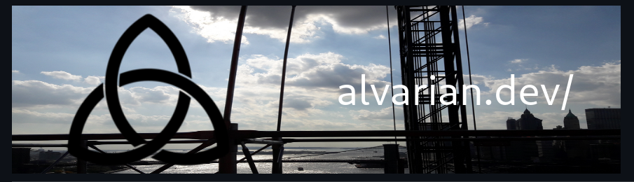

[](https://alvarian.dev/)

---

[](https://www.linkedin.com/in/alvarezivan88/)
[](https://www.codewars.com/users/Alvarian_/)
[](https://www.meetup.com/members/267302441/)

# About

As a junior developer and polyglot enthusiast, I have a passion for solving problems and creating innovative solutions using a variety of programming languages, including JavaScript, Python, Bash, and SQL. I am always eager to learn new technologies and expand my skill set. Check out my GitHub repositories to see some of my projects and to follow my journey as a developer.

Future technologies will be included touching more on native deployments and web assembly with a focus on automation.

## Overview


# Project integrations ⚠️
All current projects in my github are classified as either a 'Site', 'Service' or 'Script', to be recognized and displayed by my portfolio. In this case, I will go over specifics with 'Script' repository types.

The unique case would be the projects that are 'Script' types because their WASM compilations are AES encrypted and are hosted in my AWS S3 bucket. Each must be AES decrypted, which would output a function as a string to be evaluated into the window's object to be in callable reach.

The key required for decryption must be the same key used to encrypt and is served as variable 'NEXT_PUBLIC_CRYPTION_KEY' in the .env file.

The README of that repository is scrapped by my portfolio and splits the text using :octocat:

Using [Rivalry's readme](https://raw.githubusercontent.com/Alvarian/rivalry/master/README.md) as an example, the last item is chosen for both my project icon and encryption:

```bash
<!-- https://dvj70ijwahy8c.cloudfront.net/Rivalry/icon | https://dvj70ijwahy8c.cloudfront.net/Rivalry/core -->
```

