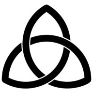

<div style="display: flex; justify-content: space-around; align-items: center; background-image: url(./assets/img_bridge3.jpg); background-repeat: no-repeat; background-size: 100%; min-width: 540px">
    
    <a style="font-size: 36pt;" href="https://alvarian.dev/">alvarian.dev</a>
</div>

---

[](https://www.linkedin.com/in/alvarezivan88/)
[](https://www.codewars.com/users/Alvarian_/)
[](https://www.meetup.com/members/267302441/)

## Welcome

Im an indie programmer from New York. Love to apply my ideas, big projects ahead. 

🦄 to be.

Future technologies will be included touching more on native deployments and web assembly.

# Project integrations ⚠️
All presentable projects are classified as either a 'Site', 'Service' or 'Script', and are displayed in my portfolio. In this case, I will go over specifics with 'Script' repository types.

The unique case would be the projects that are 'Script' types because their WASM compilations are AES encrypted and are hosted in my AWS S3 bucket. Each must be AES decrypted, which would output a function as a string to be evaluated into the window's object to be in callable reach.

The key required for decryption must be the same key used to encrypt and is served as variable 'NEXT_PUBLIC_CRYPTION_KEY' in the .env file.

The README of that repository is scrapped by my portfolio and splits the text using :octocat:

The last item is chosen for both my project icon and encryption:

```bash
<!-- https://dvj70ijwahy8c.cloudfront.net/Rivalry/icon | https://dvj70ijwahy8c.cloudfront.net/Rivalry/core -->
```

